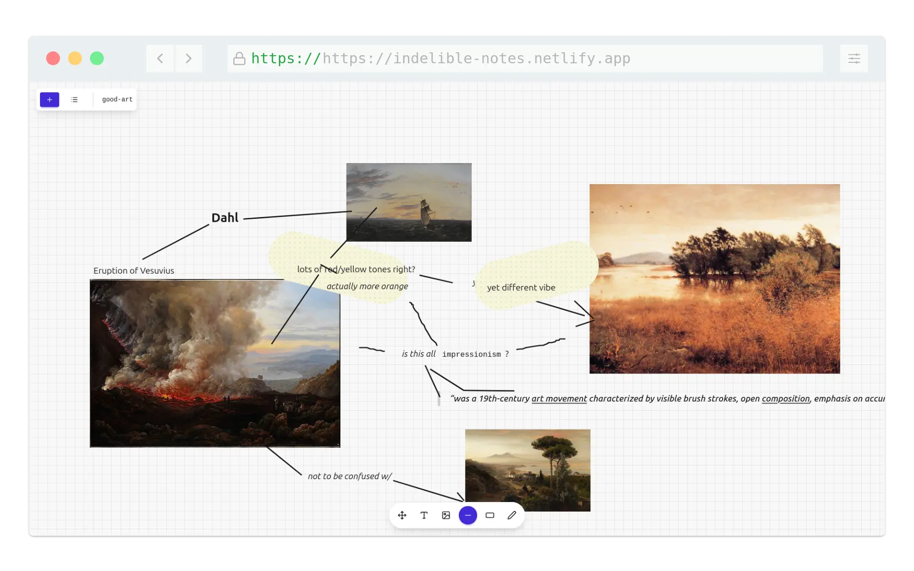

# Indelible

A minimalist infinite canvas application for creating and organizing visual notes, drawings, and text.

## Features

### Multi-Canvas Management
- **Multiple Canvases**: Create and manage multiple independent canvases
- **URL-based Navigation**: Each canvas has a unique slug in the URL
- **Quick Switching**: Switch between canvases via the canvas list modal
- **Persistent Storage**: All data stored locally using IndexedDB (Dexie)

### Tools

#### Pan Tool (Space)
- Navigate the infinite canvas
- Drag to move around
- Mouse wheel to zoom in/out

#### Text Tool (T)
- Click anywhere to add rich text
- **Markdown Shortcuts**:
  - `*` or `-` or `+` followed by space → Bullet list
  - `1.` followed by space → Numbered list
  - `>` followed by space → Blockquote
  - `**bold**` → **Bold text**
  - `*italic*` → *Italic text*
  - Typography shortcuts: `(c)` → ©, `->` → →, etc.
- **Keyboard Shortcuts**: Ctrl/Cmd + B/I/U for bold/italic/underline
- **Styling**: Rendered with Tailwind Typography for professional appearance
- Click outside text editor or press Escape to save

#### Image Tool (I)
- Paste images directly from clipboard
- Or select image file via file dialog
- Choose size (small/medium/large) before placing
- Position image preview on canvas
- Click to place
- Press Escape to cancel

#### Line Tool (L)
- Click to start line
- Move mouse to set end point
- Click again to place
- Press Escape to cancel

#### Tape Tool (A)
- Like the line tool but creates a washi tape effect
- Textured, wider appearance simulating masking tape
- Same click-drag-click interaction

#### Draw Tool (D)
- Free-form drawing
- Click and drag to draw continuous paths
- Release mouse to finish
- Press Escape to cancel

## Technical Stack

- **Vue 3** with TypeScript and Composition API
- **Vite** for fast development and building
- **TailwindCSS v4** for styling
- **DaisyUI** for UI components
- **Tiptap** for rich text editing with markdown
- **Dexie** (IndexedDB wrapper) for local storage
- **Lucide Vue** for icons

## Project Structure

```
src/
├── components/
│   ├── InfinitePannableCanvas.vue  # Main canvas component
│   ├── Toolbar.vue                 # Tool selection UI
│   ├── TextInput.vue               # Rich text editor (Tiptap)
│   ├── HtmlText.vue                # Text rendering component
│   ├── ImagePreview.vue            # Image placement preview
│   ├── ImageSizeModal.vue          # Image size selector
│   ├── DrawingPreview.vue          # Line/tape/draw preview
│   ├── NewCanvasModal.vue          # Create new canvas
│   └── CanvasListModal.vue         # Switch/delete canvases
├── composables/
│   ├── useCanvasManager.ts         # Canvas & element CRUD operations
│   └── useCanvasState.ts           # Tool state & workflow management
├── stores/
│   └── database.ts                 # Dexie database schema
├── utils/
│   ├── imageProcessor.ts           # Image handling & resizing
│   └── fileUpload.ts               # File dialog utilities
├── App.vue                         # Main app component
└── style.css                       # Global styles
```

## Architecture

### State Management

**useCanvasManager**: Handles data persistence
- Loading/creating/switching canvases
- Adding elements (text, images, drawings) to canvas
- Interacts with Dexie database

**useCanvasState**: Manages UI state and workflows
- Current tool selection
- Active workflows (image placement, drawing, text input)
- Tool-specific state machines

### Data Model

**Canvas**:
- `slug`: Unique identifier in URL
- `createdAt`, `updatedAt`: Timestamps

**CanvasElement**:
- `type`: 'text' | 'image' | 'line' | 'tape' | 'drawing'
- `x`, `y`: Position on infinite canvas
- `data`: Content (HTML for text, base64 for images, JSON path for drawings)
- `scale`: Element scaling
- `width`, `height`: Image dimensions
- `endX`, `endY`: Line/tape endpoints
- `timestamp`: Creation time

### Rich Text Implementation

- **Input**: Tiptap editor with StarterKit, Underline, Link, Typography extensions
- **Rendering**: Tailwind Typography's `prose` classes for automatic styling
- **Storage**: HTML stored directly in database
- **Sanitization**: Only allow safe tags (p, strong, em, ul, ol, li, blockquote, a, h1-h6)

### Image Workflow

1. User triggers image tool (keyboard shortcut or file paste)
2. Image processed and resized (max 4000x4000px)
3. Size selection modal appears
4. Preview follows cursor
5. Click to place at position
6. Stored as base64 data URL in database

## Development

```bash
# Install dependencies
npm install

# Run dev server
npm run dev

# Build for production
npm run build

# Lint code
npm run lint
```

## Data Storage

All data is stored locally in the browser using IndexedDB:
- Database name: `IndelibleDB`
- Tables: `canvases`, `canvasElements`
- No server-side storage
- Data persists across sessions

## Keyboard Shortcuts

- `Space` - Pan tool
- `T` - Text tool
- `I` - Image tool
- `L` - Line tool
- `A` - Tape tool
- `D` - Draw tool
- `Escape` - Cancel current action
- `Ctrl/Cmd + B` - Bold (in text editor)
- `Ctrl/Cmd + I` - Italic (in text editor)
- `Ctrl/Cmd + U` - Underline (in text editor)

## Browser Compatibility

Requires modern browser with:
- ES6+ JavaScript support
- IndexedDB support
- Clipboard API (for paste functionality)
